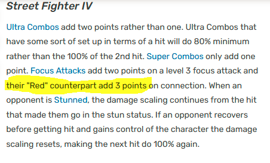

# Project-Portfolio-3
 
# Ultra Street Fighter 4 damage calculator

Street Fighter 4 is a game that released in 2008 in arcades to worldwide positive acclaim and ushered in a new era of growth and interest in the entire genre of fighting games which persists to this day.

It's final version, Ultra Street Fighter 4, released on Arcade machines, the Xbox 360 and the Playstation 3 in 2014, and remains a fan favourite to this day.

The core of the game play revolves around damaging your opponent to deplete their health (sometimes referred to as HP or Health Points).

_Health being depleted_

There are only two win conditions:
1. Deal enough damage to fully deplete your opponents health

_This one is surprisingly easy to calculate_
 
2. There is a time limit per round. If nobody has had their health fully depleted when the time runs out, whoever has a higher percentage of their total health remaining wins. Most of the time this means whoever deals the most damage wins.

_Left side Ryu has slightly more health than Right side Ryu_

Despite the fact that **damage** is absolutely key to every win condition in the game, there are no calculators online or on the mobile app stores to allow players to work out how much total damage a particular combination of attacks (or "combo") would do. Having such a thing would help players to optimise what they do when they're not playing.

_On first search, only one calculator app shows up in the search results_

_This leads to a reddit topic, which points to a google play store link_

_This link is dead_

_Last developer comment was 9 years ago (2014 at time of writing). It is safe to assume the project is dead_

A calculator still has value today even when playing the game, because health values are obfuscated behind a graphical _"HP bar"_ which, as it depletes, decreases in length and changes from yellow to red. Excluding when players have 100% health, and 0% health (when they are defeated), players can never actually know exactly how much health they currently have.

_A full length health bar usually represents 1000 health. Ryu probably has 850 health remaining. Abel maybe has 300? Even within the game it's not very clear_

## Features
---

## Existing features

## Future features

## Design
---
Code Logic on Paper

## Coding

While coding, before tackling the full dataset of all json files for all characters, a more simplified dataset was created by hand of just the damage numbers, of just the character Ryu.

This file is called RyuList.json

To expedite the testing of this function, the names of the attacks were shortened down from their technically correct names to community slang words

For example: The attack "Hurrican Kick" is shortened to what the character shouts when the attack is performed, which is "Tatsu"

Also to simplify user input error checking later, all string characters are changed to lowercase

Additionally for one of the attacks "Shoryuken lp/mp FADC" the damage value was listed as [0]. Without going into too much detail, "FADC" is community shorthand for cancelling an attack on the first hit and ignoring the remaining hits.
So an attack of [40, 50, 60]; if "FADC"d; would be [40] only

Since the damage values of "Shoryuken lp" and "Shoryuken mp" are listed as [100] and [80,50] respectively, there is no scenario where performing "Shoryuken lp/mp FADC" would return the same value for either, nor return a value of [0]

From this it must be concluded that this value is incorrect, so it was removed altogether.

Once finalised, the dictionary of strings for keys and lists for damage values looks as follows:

### Data Formatting

Data from the json files looks as follows

The damage numbers are displayed as such:

"damage": "60x5*173",

But for convenience it would better if they were displayed as such:

"damage": [60,60,60,60,60,173]

Some damage is represented bafflingly confusingly

"damage": "270*38x4*50x3[270*233]"

## Testing
---

On the street fighter wiki I found the following claim regarding the formula

This would have run contrary to 

## References

Ultra Street Fighter 4 Frame Data source #1 by [Vertigo] (https://github.com/vertigo65536/frame-data/tree/master/sf4) (used extensively)

Ultra Street Fighter 4 Frame Data source #2 by [jpgnotgif](https://github.com/jpgnotgif/usf4-frame-data) (not used, but checked in the hopes of better formatted data)

FAT frame data app Github page by [D4rkOnion](https://github.com/D4RKONION/FAT) (not used, but checked)

